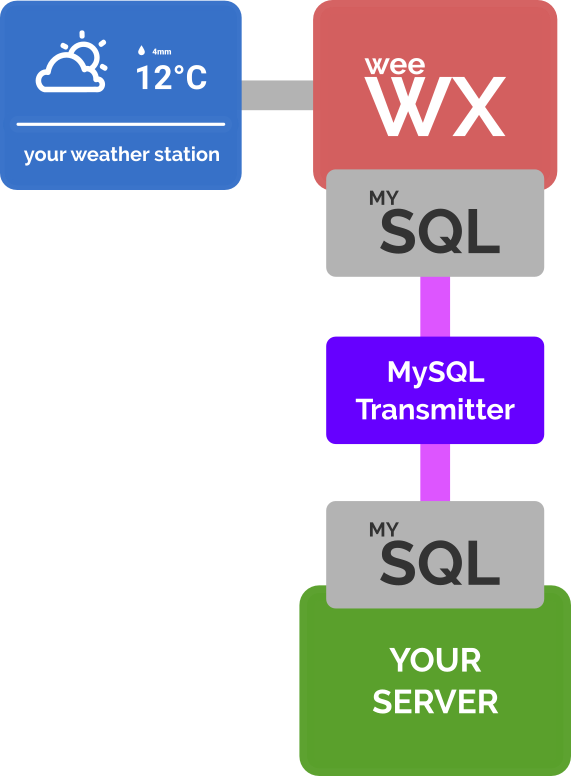

# Weewx MySQL Transmitter
Small python addon to [weewx](https://github.com/weewx/weewx) to transfer the data weewx stores in a mysql database to a public mysql server. 
The following picture shows the concept behind it.

<hr>



<hr>

<span style="color:red">**Attention!**</span>

The MySQL Transmitter project is still in progress. There is no fully working version yet!

# Setup

The following setup tutorial explains all steps to use this addon successfully.

## Prerequisites

Weewx must be set up and use MySQL/MariaDB. The default is SQLite, but you can easily change this by following a few steps. 
### Step 1: Installing MySQL & The Corresponding Python Library
```bash
sudo apt update
sudo apt install mariadb-client mariadb-server python3-mysqldb
```
### Step 2: Securing MySQL (Optional)
Optionally you can secure your MySQL by setting the root user's password.
Run the following command to do so. It is recommended to answer "Y" (yes) to all questions.

```bash
sudo mysql_secure_installation
```
### Step 3: Connecting to MySQL
To connect to MySQL you have to log in as root user.

```bash
sudo mysql -u root -p
```
After executing this command (and entering your sudo password), you need to enter the root user's password. If you skipped step 2 there is no password, so just press [ENTER].
### Step 4: Giving Permissions To Weewx
Normally weewx logs in to mysql with the user "weewx" and the password "weewx" to store the weather data in the database "weewx". To make this possible, we have to create the weewx user and give him the necessary rights.
```mysql
mysql> CREATE USER 'weewx'@'localhost' IDENTIFIED BY 'weewx';
mysql> GRANT select, update, create, delete, insert, drop ON weewx.* TO weewx@localhost;
```
After that we're done with configuring mysql and are ready to tell weewx. But first we exit using this small command.

```mysql
mysql> quit;
```
### Step 5: Configuring Weewx To Use MySQL
To configure weewx to use MySQL we need to edit the configuration file. A good text editor to use is "nano".

```mysql
sudo nano /etc/weewx/weewx.conf
```

Now go to ` [[wx_binding]]` and change `database = archive_sqlite` to `database = archive_mysql`. Press [CTRL]+[X] to exit the file, answer "y" (yes) to store the changes.
### Step 6: Reloading The Configuration File
If your weewx application is already running, you need to reload the configuration file.

```mysql
sudo /etc/init.d/weewx reload
```
### Step 7: Check If Everything Is Working (Optional)
To make sure everything is working, you should check the status of weewx.

```mysql
sudo /etc/init.d/weewx status
```
Run this command several times in a row. If no red error messages appear, everything is working fine.

## Setting Up The MySQL Transmitter
Now we are ready to setup the MySQL transmitter.
### Step 1: Installation
```bash
some command (work still in progress)
```

### Step 2: Giving Permissions

Normally the  transmitter logs in to mysql with the user "transmitter" and the password "transmitter" to read the weather data from the database "weewx". To make this possible, we have to create the user and give him the necessary rights. 

```bash
sudo mysql -u root -p
```

```mysql
mysql> CREATE USER 'transmitter'@'localhost' IDENTIFIED BY 'transmitter';
mysql> GRANT select, update, alter ON weewx.* TO transmitter@localhost;
mysql> quit;
```

### Step 3: Configuring The MySQL Server

Just create an empty MySQL database on the server.  There should be an user that has all privileges on this database. Note the database name, the username and the user's password.

### Step 4: Configuring The Transmitter

The MySQL transmitter needs to know which server to transmit the weather data to. To do this, it also needs to know how to log into the database on the MySQL server. For this we have to edit the transmitter's configuration file.

```bash
sudo nano /etc/weewxTransmitter/config.yaml
```

Now go to `connectionToServer`and set the `host`, `username` and `password`.
Optionally we are able to change the transmission interval.
You can do this by changing the `transmissionInterval` variable to any desired value. Everything from one second (e.g. `1s`), to several minutes (e.g. `5m`), to hours (e.g. `12h`) or days (e.g. `5d`) is valid. If you want live updates set the value to `LIVE`. This should be the default value. The transmitter will only transmit data if there is any. Therefore the `transmission_interval` is the minimum time it takes until a new dataset is sent.

*Example*:

```yaml
settings:
    connectionToServer:
        host: your.host.address
        username: yourusername
        password: yourpassword
        transmissionInterval: LIVE
 (...)
```

Press [CTRL] + [X] to exit the configuration file, answer "y" (yes) to save the changes.

### Step 5: Running The Transmitter as Daemon
Finally we are now able to run the transmitter:
```bash
sudo nano /etc/init.d/weewxTransmitter start
```
Use `sudo /etc/init.d/weewxTransmitter status` to check if everything is working fine.
Use `sudo /etc/init.d/weewxTransmitter restart` to restart the daemon.
Use `sudo /etc/init.d/weewxTransmitter stop` to stop the daemon.
